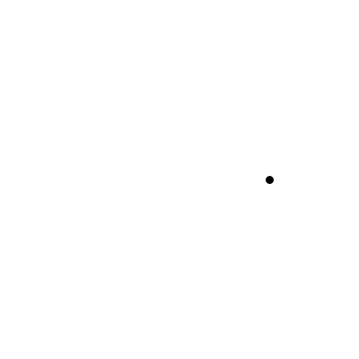
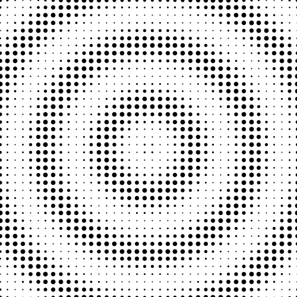
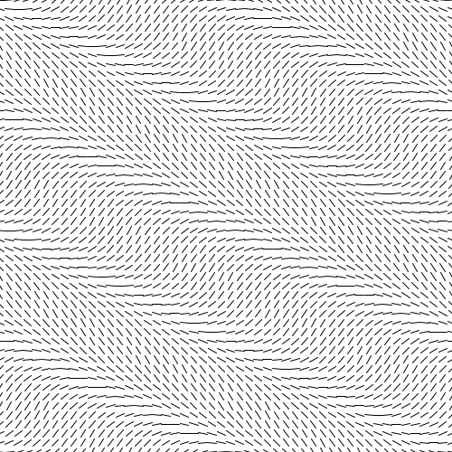
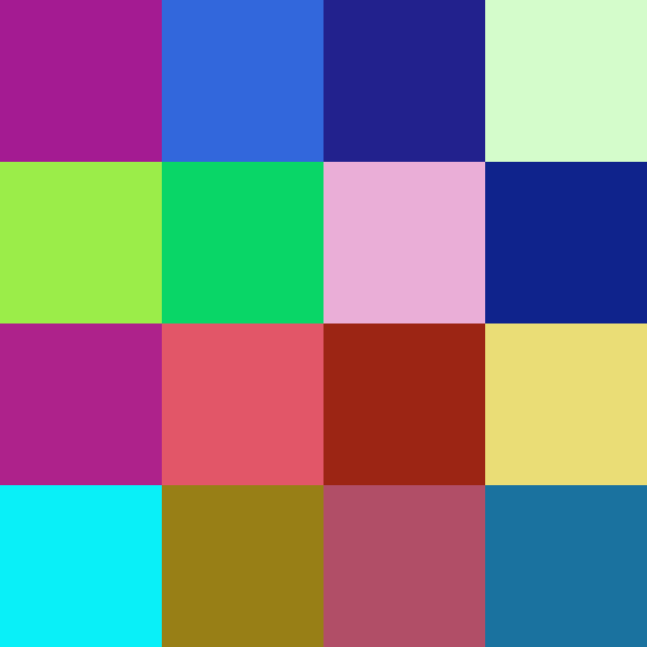
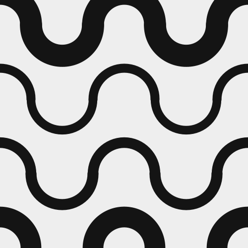

# Daily Coding Animation
The goal is to create something expressive instead of something functional. Made with processing.

| | | |
|:-------:|:-------:|:-------:|
|
<a href="./DotMovingCircle/">Day 1</a>
|
<a href="./PeriodicDotMoving">Day 2</a>
|
<a href="./LineConstellation" >Day 3</a>

|
<a href="./FacesWithSpiralOffset">Day 4</a>
|
<a href="./LineConstellationV2">Day 5</a>
|
<a href="./SquaredColors">Day 6</a>
|
<a href="./SinusoideArcWaves">Day 7</a>
|
<a href="./SinusoideArcWaves">Day 8</a>
|
<a href="./SinusoideArcWaves">Day 9</a>
|
